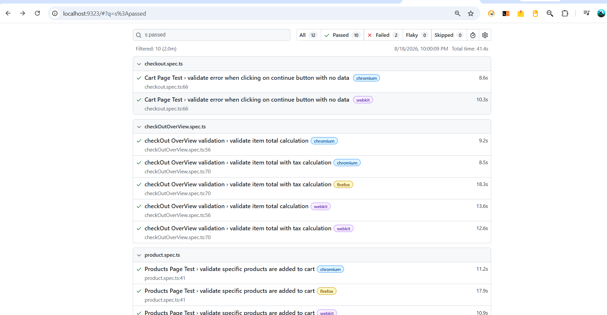
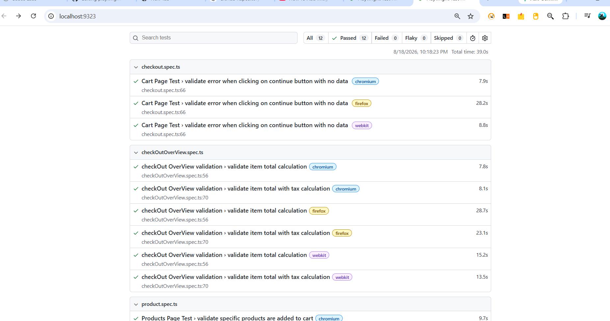

# Playwright TypeScript Automation Framework

A professional end-to-end test automation framework built using Playwright and TypeScript, following Page Object Model (POM), reusable test components, cross-browser testing, parallel execution, reporting, and CI/CD practices.

## Tech Stack

- Playwright
- TypeScript
- Node.js
- Git & GitHub
- GitHub Actions

## Features

- Page Object Model (POM)
- Reusable page and locator components
- Cross-browser testing
- Parallel test execution
- Environment-based configuration
- HTML test reporting
- Screenshot on test failure
- Video recording on test failure
- Trace collection for debugging
- GitHub Actions CI/CD

## Framework Structure

```text
playwright MCP/
│
├── .github/
│   └── workflows/
│       └── playwright.yml          # CI/CD workflow
│
├── locators/                       # Page element locators
│   ├── cartPageLocator.ts
│   ├── checkOutOverviewLocator.ts
│   ├── checkoutPageLocator.ts
│   ├── finalPageLocator.ts
│   ├── loginLocator.ts
│   └── productLocator.ts
│
├── pages/                          # Page Object Model classes
│   ├── cartPage.ts
│   ├── checkOutOverviewPage.ts
│   ├── checkoutPage.ts
│   ├── finalPage.ts
│   ├── loginPage.ts
│   └── productsPage.ts
│
├── test-data/                      # Test data
│   ├── checkoutData.ts
│   └── products.ts
│
├── tests/                          # Test specifications
│   ├── E2E/
│   ├── cart.spec.ts
│   ├── checkOutOverView.spec.ts
│   ├── checkout.spec.ts
│   ├── login.spec.ts
│   └── product.spec.ts
│
├── utils/                          # Reusable utilities
│   └── envConfig.ts
│
├── playwright.config.ts            # Playwright configuration
├── package.json                    # Project dependencies/scripts
├── package-lock.json
├── .gitignore
└── README.md


### Folder Responsibilities

| Folder/File | Purpose |
|---|---|
| `pages/` | Contains Page Object Model classes and reusable page actions |
| `locators/` | Centralizes page element locators |
| `tests/` | Contains UI and end-to-end test cases |
| `test-data/` | Stores reusable test data |
| `utils/` | Contains reusable utilities and configuration |
| `.github/workflows/` | Handles CI/CD test execution |
| `playwright.config.ts` | Configures browsers, execution, retries, reporting and debugging |

## Installation & Setup

### Prerequisites

Make sure the following are installed:

- Node.js
- npm
- Git
- VS Code

### Clone the Repository

```bash
git clone https://github.com/lalitsali/playwright-typescript-automation.git
cd playwright-typescript-automation


## Test Coverage

The framework currently covers the following functional areas:

### Login

- Valid user login
- Login page validation
- Authentication flow
- Navigation after successful login

### Product

- Product listing
- Product selection
- Product details
- Product-related validations

### Cart

- Add product to cart
- Remove product from cart
- Cart item validation
- Cart navigation

### Checkout

- Checkout information
- Checkout overview
- Order summary validation
- Checkout completion

### End-to-End

- Complete user journey from login to order completion

## Test Types

| Test Type | Coverage |
|---|---|
| UI Testing | Web application functionality |
| Functional Testing | Feature-level validation |
| End-to-End Testing | Complete user workflows |
| Regression Testing | Existing functionality validation |
| Cross-Browser Testing | Chromium, Firefox and WebKit |

## Reporting & Debugging

The framework uses Playwright's built-in reporting and debugging capabilities.

### HTML Report

After test execution, generate and view the HTML report using:

```bash
npx playwright show-report


## CI/CD

This framework uses GitHub Actions to automatically execute Playwright tests.

### Workflow

```text
Code Push
   ↓
GitHub Actions
   ↓
Install Node.js dependencies
   ↓
Install Playwright browsers
   ↓
Execute Playwright tests
   ↓
Generate test report




